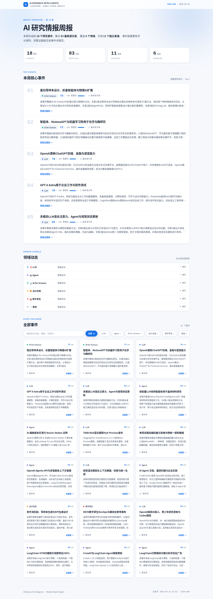
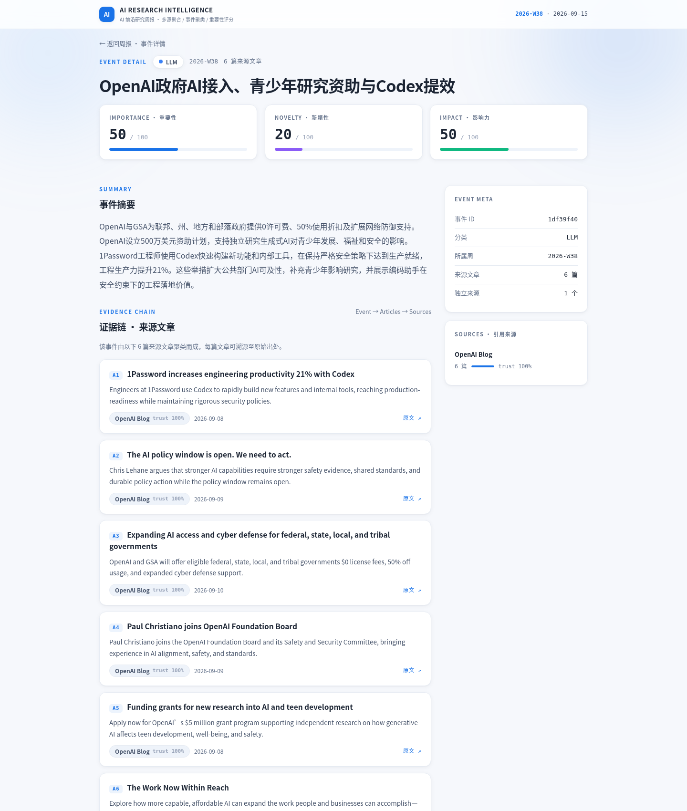
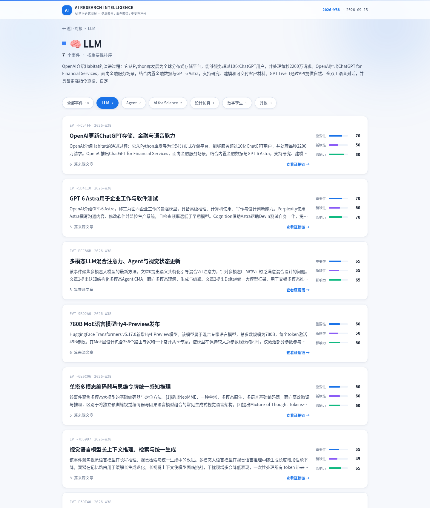

# Weekly AI Report

Autonomous agent that fetches AI research news from multi-source feeds, filters, classifies, clusters, and scores it, then generates a weekly report website — auto-deployed to GitHub Pages.

**Latest report:** https://loanne-lxy.github.io/weekly-ai-report/2026-W38/

## Demo

| Home — hero stats, top events, domain signals, search/filter explorer | Event detail — scores, summary, evidence chain | Category — event list with per-score bars |
|---|---|---|
|  |  |  |

Frontend: Jinja2 + inline CSS, Material 3 light theme, pure vanilla JS (client-side search over event title/summary/category + category filter pills), no frameworks, no CDN, no external fonts.

## Pipeline

```
Sources (source.db, DB-first)
  │
  ├── Phase 1  : Fetch          RSS / GitHub / arXiv / Exa, connector registry, asyncio concurrency=10
  ├── Phase 2  : Hard Dedup     URL Registry (md5, SQLite)
  ├── Phase 2.3: Blacklist      keyword regex pre-filter (zero-token)
  ├── Phase 3  : Clustering     FastEmbed (multilingual-MiniLM) + FAISS greedy cosine
  ├── Phase 3.5: Event Curator  LLM: classify + importance/novelty/impact scoring + summaries
  ├── Phase 5  : Generate       Jinja2 HTML (home + category pages + per-event evidence pages)
  └── Phase 6  : Source Eval    weekly source scoring, auto-archive stale (4 wks), auto-discovery
```

The LLM curates at **event level** (not article level): clustered events get Chinese titles, summaries, and 0–1 scores; the report is event-centric, and every event page links back down to its source articles and original URLs (evidence chain).

## Quick Start

```bash
git clone https://github.com/loanne-lxy/weekly-ai-report.git
cd weekly-ai-report
python3 -m venv venv && source venv/bin/activate
pip install -r requirements.txt

cp .env.example .env   # QWEN_API_KEY required; GITHUB_TOKEN / EXA_API_KEY optional
python main.py         # full weekly run → output/<YEAR>-W<WEEK>/
```

Output: `output/<YEAR>-W<WEEK>/index.html` (+ `category pages`, `events/*.html`). Open in a browser, or push `output/` to trigger the Pages deploy (below).

**Run modes**

```bash
python main.py --reset                # reset dedup DB (testing)
python main.py --baseline             # sampled sources + metrics, save baseline
python main.py --regression <dir>     # compare a run against a saved baseline
python main.py --from-cache FILE      # reuse a previously saved raw-article cache
```

## Project Structure

```
weekly-ai-report/
├── main.py                  # Pipeline orchestrator (all phases)
├── config.yaml              # Model / fetch / filter / category keywords / evaluator
├── sources.yaml             # Seed source definitions (migrated into source.db)
├── .env / .env.example      # API keys (QWEN_API_KEY, GITHUB_TOKEN, EXA_API_KEY, LANGSMITH_*)
│
├── source_registry.py       # DB-first source registry
├── source_db.py             # SQLite source store (eval_score, streak_failures, status)
├── article_db.py            # SQLite article / event / event_articles store
├── url_registry.py          # Hard URL dedup (md5 + SQLite)
├── candidate_pool.py        # Source candidate pool (discovery → verify → DB)
├── embedding_model.py       # Unified FastEmbed loader (multilingual-MiniLM, ONNX, offline)
│
├── fetcher/
│   ├── base_extractor.py    # Base extractor interface
│   ├── extractors.py        # RSS / GitHub / Web / arXiv / HF extractors
│   ├── connector_registry.py# Source type → connector mapping
│   ├── fetch_manager.py     # Async orchestrator, concurrency control
│   └── ingestion_manager.py # Phase-1 ingestion wrapper
│
├── dedup/deduplicator.py    # URL + source + date hard dedup (SQLite)
│
├── filter/
│   ├── blacklist_filter.py  # Zero-token keyword pre-filter
│   ├── event_curator.py     # LLM event curation: classify + score + summary
│   ├── link_miner.py        # Outbound-link mining from high-score articles
│   ├── scoring.py           # Time-weighted scoring (new +3, old −2)
│   ├── source_discoverer.py # Exa API neural search for source discovery
│   └── filter_summarizer.py # (legacy batch curator, currently unused)
│
├── event_clustering.py      # FAISS cosine clustering (jieba CJK pre-tokenization)
│
├── generator/
│   ├── report_generator.py  # Jinja2 rendering: home + categories + event pages
│   └── templates/
│       ├── index.html       # Home: KPI stats, top events, domain signals, explorer
│       ├── category.html    # Category pages (event list + score bars + nav pills)
│       └── event.html       # Per-event detail: scores, summary, evidence chain, sources
│
├── evaluator/
│   ├── source_evaluator.py  # Weekly source scoring, archival (stale_weeks=4)
│   └── source_discoverer.py # LLM-based new source recommendations
│
├── models/llm_client.py     # OpenAI-compatible client + optional LangSmith tracing
├── extractors/contract.py   # RawArticle / CuratedArticle Pydantic schemas
│
├── baseline_runner.py       # Baseline / regression metrics
├── scripts/preview_templates.py  # Render templates into /tmp from saved output
├── tests/                   # E2E + fix regression scripts
└── output/
    └── <YEAR>-W<WEEK>/      # Generated HTML + articles.json
```

## Categories

| Category | Scope |
|---|---|
| LLM | Core model tech (architecture, pre/post-training, inference, evaluation) |
| Agent | AI agents (tool use, multi-agent, ReAct, planning, self-improvement) |
| AI for Science | AI-driven science (protein, molecules, drugs, materials) |
| 设计仿真 | AI-assisted engineering (CAD/CAE/CFD, 3D, generative design) |
| 数字孪生 | Digital twin (IoT, real-time simulation, predictive maintenance) |

Unclassified items fall into 其他.

## Key Features

- **6-stage pipeline** — Fetch → Hard Dedup → Blacklist → Cluster → LLM Curate → Report + source evaluation
- **Event-centric output** — articles cluster into events; each event page carries an evidence chain down to source articles and original URLs
- **DB-first sources** — `source.db` is the runtime truth; YAML is seed only
- **Source self-evolution** — weekly eval, auto-archive stale sources (4 wks), auto-discovery via Exa + LLM + link mining, candidate pool verification
- **Offline-capable embeddings** — FastEmbed multilingual-MiniLM (ONNX quantized), `HF_HUB_OFFLINE=1` safe
- **LLM caching** — SHA256 content hash + prompt versioning (auto-invalidate on prompt change)
- **Zero-token pre-filter** — blacklist regex kills funding/noise items before any LLM call
- **Cumulative per week** — multiple runs in the same week merge, newest-first
- **Empty category fallback** — no new articles → carry over from up to 4 previous weeks
- **Time-weighted scoring** — new events +3, old −2
- **Frontend** — Material 3 light theme, CSS-only animations, client-side search + category filter, no JS framework, no CDN (intranet-safe)
- **LangSmith tracing** — opt-in via `LANGSMITH_TRACING=true`

## Configuration

### Model (`config.yaml`)

```yaml
model:
  provider: custom          # any OpenAI-compatible endpoint
  name: Qwen3.8-27B
  base_url: http://your-endpoint/v1
  api_key: ${QWEN_API_KEY}
  temperature: 0.3
  max_tokens: 24576
  max_retries: 5
  timeout: 600
```

### Sources (`sources.yaml` — seed only)

```yaml
sources:
  - name: OpenAI Blog
    url: https://openai.com/blog/rss.xml
    type: rss
    default_category: LLM
```

Source types: `rss` | `web` | `github_trending` | `github_repo` | `arxiv` | `hf` | `wechat`

Runtime source state (eval_score, status, streak_failures) lives in `source.db`; YAML is only the initial seed.

### Blacklist (`config.yaml → filter.blacklist_keywords`)

```yaml
- "融资"
- "股价"
- "NFT"
- "web3"
# ... add your own (matched before any LLM call, zero-token)
```

## Tech Stack

- **Python 3.11**, `asyncio` (fetch concurrency = 10)
- **LLM**: Qwen3.8-27B (reasoning model) via any OpenAI-compatible endpoint
- **Embeddings**: FastEmbed — paraphrase-multilingual-MiniLM-L12-v2 (ONNX, quantized, offline-capable)
- **Vector search**: FAISS (greedy cosine clustering)
- **Storage**: SQLite × 3 (`source.db`, `article.db`, URL registry)
- **Schemas**: Pydantic (`RawArticle` / `CuratedArticle`)
- **Frontend**: Jinja2 + inline CSS (Material 3 light) + vanilla JS; no framework, no CDN, no external fonts
- **Observability**: LangSmith (opt-in)
- **Deploy**: GitHub Actions → GitHub Pages (`.github/workflows/deploy.yml`)

## Deploy to GitHub Pages

`.github/workflows/deploy.yml` deploys on any push that touches `output/**` (or `workflow_dispatch`). It uploads `output/` and publishes via the Pages artifact action — no manual worktree steps:

```bash
# after a run:
git add output/2026-W38
git commit -m "deploy 2026-W38"
git push origin master
```

Latest report: `https://loanne-lxy.github.io/weekly-ai-report/<YEAR>-W<WEEK>/`

## Cron

```cron
# Every Monday 08:00 — run, commit, push (push triggers the Pages deploy)
0 8 * * 1 cd ~/weekly-ai-report && source venv/bin/activate && python main.py && git add output && git commit -m "weekly report $(date +%G-W%V)" && git push
```

---

Built during an internship at **TCL Research, Wuhan** · 2026